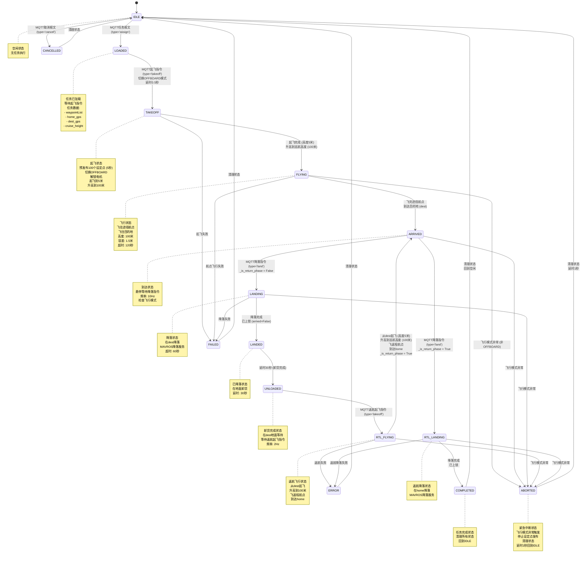

# 飞机控制完整时序图

## 1. 任务状态定义

| 状态 | 名称 | 说明 |
|------|------|------|
| IDLE | 空闲 | 无任务，等待任务分配 |
| LOADED | 任务已加载 | 任务数据已加载，等待起飞指令 |
| TAKEOFF | 起飞中 | 从地面起飞到目标高度 |
| FLYING | 飞行中 | 飞往目的地（途径航点+最终目的地） |
| ARRIVED | 已到达 | 到达目的地，悬停等待降落指令 |
| LANDING | 降落中 | 降落到地面 |
| LANDED | 已降落 | 已降落，卸货中 |
| UNLOADED | 卸货完成 | 卸货完成，等待返航起飞指令 |
| RTL_FLYING | 返航飞行中 | 从目的地返回home点 |
| RTL_LANDING | 返航降落中 | 在home点降落 |
| COMPLETED | 任务完成 | 任务完成，回到IDLE状态 |
| CANCELLED | 取消 | 任务取消 |
| FAILED | 失败 | 任务失败 |
| ERROR | 错误 | 错误状态 |
| ABORTED | 紧急中断 | 飞行模式异常触发紧急中断 |

## 2. 关键参数配置

| 参数 | 默认值 | 说明 |
|------|--------|------|
| takeoff_alt | 5.0米 | 起飞高度（相对地面AGL） |
| unload_timeS | 30.0秒 | 卸货等待时间 |
| waypoint_tolerance | 1.5米 | 航点到达容差 |
| pre_land_alt | 3.0米 | 降落前高度（预留） |
| ground_threshold | 0.25米 | 地面判定阈值 |
| cruise_height | 100米 | 巡航高度（任务参数） |
| phase_timeout | 120.0秒 | 各阶段超时时间 |
| setpoint_rate | 20Hz | 设定点发布频率 |
| telemetry_rate | 50Hz | 遥测数据发布频率 |

## 3. MQTT话题定义

| 话题 | 方向 | 说明 |
|------|------|------|
| `drone/{drone_id}/task` | 接收 | 任务报文（assign/cancel） |
| `drone/{drone_id}/command` | 接收 | 控制指令（takeoff/land/rtl） |
| `drone/{drone_id}/telemetry` | 发送 | 遥测数据（位置、速度、电池等） |
| `drone/{drone_id}/status` | 发送 | 任务状态更新 |

## 4. MAVROS话题和服务

### 发布话题
- `/mavros/setpoint_position/local` - 本地位置设定点（PoseStamped）
- `/mavros/setpoint_position/global` - GPS位置设定点（GeoPoseStamped）

### 订阅话题
- `/mavros/state` - 飞行状态
- `/mavros/local_position/pose` - 本地位置（ENU坐标）
- `/mavros/local_position/velocity_local` - 本地速度
- `/mavros/global_position/global` - GPS全局位置
- `/mavros/global_position/rel_alt` - 相对高度
- `/mavros/battery` - 电池状态
- `/mavros/home_position/home` - Home点位置

### 服务调用
- `/mavros/cmd/arming` - 解锁/上锁服务（CommandBool）
- `/mavros/set_mode` - 模式切换服务（SetMode）
- `/mavros/cmd/land` - 降落服务（CommandTOL）

## 5. 完整任务流程时序图

```mermaid
sequenceDiagram
    participant GCS as GCS地面站
    participant MQTT as MQTT Broker
    participant Node as CoffeeProjNode
    participant SM as TaskStateMachine
    participant FC as FlightController
    participant MAVROS as MAVROS/飞控
    
    Note over Node: 状态: IDLE
    
    %% ===== 阶段1: 任务分配 =====
    GCS->>MQTT: 任务报文 (type='assign')
    MQTT->>Node: 任务报文
    Node->>Node: 解析任务数据
    Node->>SM: set_task_data(task_data)
    Node->>SM: set_state(LOADED)
    Node->>MQTT: status: LOADED, "等待起飞"
    MQTT->>GCS: 状态更新
    
    Note over Node: 状态: LOADED
    
    %% ===== 阶段2: 去程起飞 =====
    GCS->>MQTT: 控制指令 (type='takeoff')
    MQTT->>Node: 控制指令
    Node->>SM: request_takeoff()
    SM->>SM: _takeoff_requested = True
    
    SM->>FC: is_offboard()?
    FC-->>SM: False
    SM->>FC: set_mode('OFFBOARD')
    FC->>MAVROS: SetMode(OFFBOARD)
    MAVROS-->>FC: success
    Note over SM: 延时0.5秒 (等待模式生效)
    
    SM->>MQTT: status: TAKEOFF, "从home起飞"
    MQTT->>GCS: 状态更新
    SM->>SM: set_state(TAKEOFF)
    
    Note over Node: 状态: TAKEOFF
    
    %% ===== 阶段2.1: 起飞执行 =====
    SM->>FC: takeoff(5.0米)
    
    FC->>FC: 创建GPS设定点 (lat=home_lat, lon=home_lon, alt=5.0米AMSL)
    
    rect rgb(240, 248, 255)
        Note over FC,MAVROS: 预发布设定点 (100个, 约5秒)
        FC->>MAVROS: 发布setpoint_position/global (20Hz)
        Note over FC: 循环100次 (5秒)
    end
    
    rect rgb(255, 250, 240)
        Note over FC,MAVROS: 切换OFFBOARD模式
        FC->>MAVROS: 发布setpoint (保持发送)
        FC->>MAVROS: SetMode(OFFBOARD)
        MAVROS-->>FC: mode_sent=True
        Note over FC: 循环发送设定点 (约0.5秒)
    end
    
    rect rgb(240, 255, 240)
        Note over FC,MAVROS: 解锁电机
        FC->>MAVROS: 发布setpoint (保持发送)
        FC->>MAVROS: CommandBool(arm=True)
        MAVROS-->>FC: success=True
        Note over FC: 循环发送设定点 (约0.5秒)
    end
    
    FC->>MAVROS: 发布setpoint_position/global (20Hz)
    Note over FC: 等待到达5米高度
    MAVROS-->>FC: relative_alt >= 5.0米
    FC-->>SM: takeoff完成
    
    Note over SM: 起飞完成，高度5米
    
    %% ===== 阶段2.2: 升高到巡航高度 =====
    alt cruise_height > takeoff_alt
        SM->>FC: goto_altitude(100米)
        FC->>FC: 获取当前GPS位置
        FC->>FC: 创建GPS设定点 (lat=当前lat, lon=当前lon, alt=100米AMSL)
        FC->>MAVROS: 发布setpoint_position/global (20Hz)
        Note over FC: 等待到达100米高度
        MAVROS-->>FC: relative_alt >= 100米
        FC-->>SM: 到达巡航高度
        Note over SM: 高度: 100米
    end
    
    SM->>MQTT: status: FLYING, "飞往目的地"
    MQTT->>GCS: 状态更新
    SM->>SM: set_state(FLYING)
    
    Note over Node: 状态: FLYING
    
    %% ===== 阶段3: 飞往目的地 =====
    
    %% 飞往途径航点
    alt waypoint_list存在
        SM->>FC: execute_waypoints(waypoint_list)
        loop 每个航点
            FC->>FC: GPS坐标转换
            FC->>MAVROS: 发布setpoint_position/global (20Hz)
            Note over FC: 等待到达航点 (容差1.5米, 超时120秒)
            MAVROS-->>FC: 到达航点
            Note over FC: 延时0秒 (立即飞下一个)
        end
    end
    
    %% 飞往目的地
    SM->>FC: execute_waypoints([dest_point])
    FC->>FC: 创建dest设定点 (lat=dest_lat, lon=dest_lon, alt=100米)
    FC->>MAVROS: 发布setpoint_position/global (20Hz)
    Note over FC: 等待到达dest (容差1.5米, 超时120秒)
    MAVROS-->>FC: 到达dest
    FC-->>SM: execute_waypoints完成
    
    SM->>MQTT: status: ARRIVED, "到达目的地，悬停等待降落"
    MQTT->>GCS: 状态更新
    SM->>SM: set_state(ARRIVED)
    
    Note over Node: 状态: ARRIVED
    
    %% ===== 阶段4: 悬停等待 =====
    SM->>FC: hover()
    FC->>MAVROS: 发布当前位置setpoint (10Hz)
    Note over SM: 悬停等待降落指令...
    
    GCS->>MQTT: 控制指令 (type='land')
    MQTT->>Node: 控制指令
    Node->>SM: request_land()
    SM->>SM: _land_requested = True
    
    SM->>MQTT: status: LANDING, "在目的地降落"
    MQTT->>GCS: 状态更新
    SM->>SM: set_state(LANDING)
    
    Note over Node: 状态: LANDING
    
    %% ===== 阶段5: 降落 =====
    SM->>FC: land()
    FC->>MAVROS: CommandTOL(altitude=0)
    MAVROS-->>FC: success
    Note over FC: 等待落地并上锁 (超时60秒)
    MAVROS-->>FC: armed=False
    FC-->>SM: 降落完成
    
    SM->>MQTT: status: LANDED, "已降落，卸货中"
    MQTT->>GCS: 状态更新
    SM->>SM: set_state(LANDED)
    
    Note over Node: 状态: LANDED
    
    %% ===== 阶段6: 卸货 =====
    Note over SM: 延时30秒 (卸货时间)
    SM->>SM: sleep(30.0秒)
    
    SM->>MQTT: status: UNLOADED, "卸货完成，等待返航起飞"
    MQTT->>GCS: 状态更新
    SM->>SM: set_state(UNLOADED)
    
    Note over Node: 状态: UNLOADED
    
    %% ===== 阶段7: 返航起飞 =====
    Note over SM: 等待返航起飞指令 (地面等待)
    
    GCS->>MQTT: 控制指令 (type='takeoff')
    MQTT->>Node: 控制指令
    Node->>SM: request_takeoff()
    SM->>SM: _takeoff_requested = True
    
    SM->>MQTT: status: RTL_FLYING, "返航起飞"
    MQTT->>GCS: 状态更新
    SM->>SM: set_state(RTL_FLYING)
    
    Note over Node: 状态: RTL_FLYING
    
    %% ===== 阶段7.1: 返航起飞执行 =====
    SM->>FC: takeoff(5.0米)
    
    FC->>MAVROS: 发布setpoint_position/global (20Hz)
    Note over FC: 预发布100个设定点 (5秒)
    FC->>MAVROS: SetMode(OFFBOARD)
    FC->>MAVROS: CommandBool(arm=True)
    Note over FC: 等待到达5米高度
    MAVROS-->>FC: relative_alt >= 5.0米
    FC-->>SM: takeoff完成
    
    Note over SM: 高度: 5米
    
    %% ===== 阶段7.2: 升高到巡航高度 =====
    alt cruise_height > takeoff_alt
        SM->>FC: goto_altitude(100米)
        FC->>MAVROS: 发布setpoint_position/global (20Hz)
        Note over FC: 等待到达100米高度
        MAVROS-->>FC: relative_alt >= 100米
        FC-->>SM: 到达巡航高度
        Note over SM: 高度: 100米
    end
    
    %% ===== 阶段8: 返航飞行 =====
    
    %% 飞返程航点
    alt rtl_type == "reverse"
        SM->>SM: return_waypoints = reversed(waypoint_list)
    else rtl_type == "new"
        SM->>SM: return_waypoints = rtl_waypoint_list
    end
    
    alt return_waypoints存在
        SM->>FC: execute_waypoints(return_waypoints)
        loop 每个航点
            FC->>MAVROS: 发布setpoint_position/global (20Hz)
            Note over FC: 等待到达航点 (容差1.5米)
            MAVROS-->>FC: 到达航点
        end
    end
    
    %% 飞往home点
    SM->>FC: execute_waypoints([home_point])
    FC->>MAVROS: 发布setpoint_position/global (20Hz)
    Note over FC: 等待到达home (容差1.5米)
    MAVROS-->>FC: 到达home
    FC-->>SM: 返航飞行完成
    
    SM->>SM: _is_return_phase = True
    SM->>MQTT: status: ARRIVED, "到达home，悬停等待降落"
    MQTT->>GCS: 状态更新
    SM->>SM: set_state(ARRIVED)
    
    Note over Node: 状态: ARRIVED (返程阶段)
    
    %% ===== 阶段9: 返航悬停等待 =====
    SM->>FC: hover()
    FC->>MAVROS: 发布当前位置setpoint (10Hz)
    Note over SM: 悬停等待降落指令...
    
    GCS->>MQTT: 控制指令 (type='land')
    MQTT->>Node: 控制指令
    Node->>SM: request_land()
    SM->>SM: _land_requested = True
    
    SM->>MQTT: status: RTL_LANDING, "在home降落"
    MQTT->>GCS: 状态更新
    SM->>SM: set_state(RTL_LANDING)
    
    Note over Node: 状态: RTL_LANDING
    
    %% ===== 阶段10: 返航降落 =====
    SM->>FC: land()
    FC->>MAVROS: CommandTOL(altitude=0)
    Note over FC: 等待落地并上锁 (超时60秒)
    MAVROS-->>FC: armed=False
    FC-->>SM: 降落完成
    
    SM->>MQTT: status: COMPLETED, "任务完成"
    MQTT->>GCS: 状态更新
    SM->>SM: set_state(COMPLETED)
    
    Note over Node: 状态: COMPLETED
    
    %% ===== 阶段11: 任务完成清理 =====
    SM->>SM: 清理状态
    SM->>SM: _is_return_phase = False
    SM->>SM: set_task_data(None)
    SM->>SM: clear_requests()
    SM->>SM: set_state(IDLE)
    
    Note over Node: 状态: IDLE
```



## 6. 去程详细时序图（从HOME起飞到目的地降落）

```mermaid
sequenceDiagram
    participant GCS as GCS地面站
    participant MQTT as MQTT Broker
    participant Node as CoffeeProjNode
    participant SM as TaskStateMachine
    participant FC as FlightController
    participant MAVROS as MAVROS
    
    Note over Node: 初始状态: IDLE
    
    %% ===== 任务分配 =====
    rect rgb(255, 245, 238)
        Note over GCS,Node: 阶段1: 任务分配
        GCS->>MQTT: type='assign', taskId, orderId, waypointList, home, dest, cruiseHeight=100米
        MQTT->>Node: 任务报文
        Node->>Node: 解析: waypointList, home_gps, dest_gps, cruise_height=100米
        Node->>Node: 为所有航点设置alt=100米
        Node->>SM: set_task_data(task_data)
        Node->>SM: set_state(LOADED)
        Node->>MQTT: status: LOADED, "等待起飞", orderId
        MQTT->>GCS: 状态更新
    end
    
    Note over Node: 状态: LOADED (等待起飞指令)
    
    %% ===== 等待起飞指令 =====
    rect rgb(240, 255, 255)
        Note over GCS,Node: 阶段2: 等待起飞指令
        GCS->>MQTT: type='takeoff', taskId
        MQTT->>Node: 控制指令
        Node->>Node: handle_command(payload)
        Node->>SM: request_takeoff()
        SM->>SM: _takeoff_requested = True
    end
    
    %% ===== LOADED状态处理 =====
    rect rgb(255, 255, 240)
        Note over SM,MAVROS: 阶段2.1: LOADED状态处理 - 切换OFFBOARD
        SM->>SM: _handle_loaded()
        SM->>SM: 检查_takeoff_requested = True
        
        SM->>FC: is_offboard()?
        FC->>MAVROS: 检查mode=='OFFBOARD'
        MAVROS-->>FC: mode != 'OFFBOARD'
        FC-->>SM: False
        
        SM->>FC: set_mode('OFFBOARD')
        FC->>MAVROS: SetMode(custom_mode='OFFBOARD')
        MAVROS-->>FC: mode_sent=True
        FC-->>SM: True
        
        Note over SM: 延时0.5秒 (等待模式切换生效)
        SM->>SM: sleep(0.5)
        
        SM->>MQTT: status: TAKEOFF, "从home起飞", orderId
        SM->>SM: set_state(TAKEOFF)
    end
    
    Note over Node: 状态: TAKEOFF
    
    %% ===== 起飞执行 =====
    rect rgb(240, 248, 255)
        Note over SM,MAVROS: 阶段2.2: TAKEOFF状态处理 - 起飞到5米
        
        SM->>SM: _handle_takeoff()
        SM->>SM: task_data = get_task_data()
        SM->>SM: takeoff_alt = 5.0米, cruise_height = 100米
        
        SM->>FC: takeoff(5.0米)
        
        Note over FC: GPS模式起飞流程
        
        FC->>FC: home_gps = get_home_gps()
        FC->>FC: amsl_alt = home_amsl + 5.0米 (计算AMSL高度)
        
        FC->>FC: make_setpointgps(home_lat, home_lon, amsl_alt)
        FC->>FC: rate = 20Hz
        
        %% 预发布100个设定点
        loop 100次 (约5秒)
            FC->>MAVROS: publish setpoint_position/global (lat, lon, alt=AMSL)
            Note over FC: rate.sleep() (0.05秒)
        end
        
        %% 切换OFFBOARD
        loop 5次尝试
            FC->>MAVROS: publish setpoint (保持发送)
            FC->>MAVROS: SetMode(OFFBOARD)
            MAVROS-->>FC: mode_sent=True (成功)
            loop 10次 (约0.5秒)
                FC->>MAVROS: publish setpoint
            end
        end
        
        %% 解锁
        loop 5次尝试
            FC->>MAVROS: publish setpoint (保持发送)
            FC->>MAVROS: CommandBool(arm=True)
            MAVROS-->>FC: success=True (成功)
            loop 10次 (约0.5秒)
                FC->>MAVROS: publish setpoint
            end
        end
        
        %% 等待到达5米
        loop 直到高度>=5米
            FC->>MAVROS: publish setpoint_position/global
            FC->>FC: current_agl = relative_alt
            alt current_agl >= 5米-0.5米
                FC-->>SM: takeoff完成 (高度5米)
            else 超时120秒
                FC-->>SM: takeoff失败
            end
            Note over FC: rate.sleep() (0.05秒)
        end
    end
    
    Note over Node: 高度: 5米 (起飞完成)
    
    %% ===== 升高到巡航高度 =====
    rect rgb(255, 250, 240)
        Note over SM,MAVROS: 阶段2.3: 升高到巡航高度100米
        
        SM->>FC: goto_altitude(100米)
        
        FC->>FC: current_lat, current_lon = 当前GPS位置
        FC->>FC: amsl_alt = home_amsl + 100米
        FC->>FC: make_setpointgps(current_lat, current_lon, amsl_alt)
        
        loop 直到高度>=100米
            FC->>FC: 更新当前GPS位置
            FC->>MAVROS: publish setpoint_position/global (lat, lon, alt=AMSL)
            FC->>FC: current_agl = relative_alt
            alt abs(current_agl - 100米) < 0.5米
                FC-->>SM: 到达巡航高度 (100米)
            else 超时120秒
                FC-->>SM: 失败
            end
            Note over FC: rate.sleep() (0.05秒)
        end
    end
    
    Note over Node: 高度: 100米 (巡航高度)
    
    SM->>MQTT: status: FLYING, "飞往目的地", orderId
    SM->>SM: set_state(FLYING)
    
    Note over Node: 状态: FLYING
    
    %% ===== 飞往途径航点 =====
    rect rgb(240, 255, 240)
        Note over SM,MAVROS: 阶段3: 飞往途径航点
        
        SM->>SM: _handle_flying()
        SM->>SM: waypoint_list = task_data['waypoint_list']
        
        alt waypoint_list不为空
            SM->>FC: execute_waypoints(waypoint_list)
            
            loop 每个航点 i
                FC->>FC: lat = waypoint[i].lat
                FC->>FC: lon = waypoint[i].lng
                FC->>FC: agl = waypoint[i].alt = 100米
                
                Note over FC: 航点i: lat=X, lon=Y, 高度100米
                
                FC->>FC: fly_to_gps(lat, lon, 100米)
                FC->>FC: amsl_alt = home_amsl + 100米
                
                loop 直到到达
                    FC->>MAVROS: publish setpoint_position/global (lat, lon, alt=AMSL)
                    FC->>FC: 计算水平距离和垂直距离
                    alt horiz_dist < 1.5米 AND vert_dist < 1.5米
                        FC->>FC: 到达航点i
                    else 超时120秒
                        FC-->>SM: 失败
                    end
                    Note over FC: rate.sleep() (0.05秒)
                end
                
                Note over FC: 延时0秒 (立即飞下一个)
            end
            
            FC-->>SM: execute_waypoints完成
        end
    end
    
    %% ===== 飞往目的地 =====
    rect rgb(255, 245, 238)
        Note over SM,MAVROS: 阶段3.1: 飞往目的地dest
        
        SM->>FC: execute_waypoints([dest_point])
        
        FC->>FC: dest_point = {lat=dest_lat, lng=dest_lon, alt=100米}
        
        Note over FC: 目的地: lat=dest_lat, lon=dest_lon, 高度100米
        
        FC->>FC: fly_to_gps(dest_lat, dest_lon, 100米)
        
        loop 直到到达dest
            FC->>MAVROS: publish setpoint_position/global (dest_lat, dest_lon, alt=AMSL)
            FC->>FC: 计算水平距离和垂直距离
            alt horiz_dist < 1.5米 AND vert_dist < 1.5米
                FC->>FC: 到达目的地
            else 超时120秒
                FC-->>SM: 失败
            end
            Note over FC: rate.sleep() (0.05秒)
        end
        
        FC-->>SM: 到达目的地
    end
    
    SM->>MQTT: status: ARRIVED, "到达目的地，悬停等待降落", orderId
    SM->>SM: set_state(ARRIVED)
    
    Note over Node: 状态: ARRIVED (在dest悬停, 高度100米)
    
    %% ===== 悬停等待降落指令 =====
    rect rgb(240, 248, 255)
        Note over SM,MAVROS: 阶段4: 悬停等待降落指令
        
        SM->>SM: _handle_arrived()
        SM->>SM: _is_return_phase = False
        
        loop 等待降落指令
            SM->>FC: hover()
            FC->>FC: 获取当前位置 (x, y, z)
            FC->>MAVROS: publish setpoint_position/local (当前位置)
            Note over FC: 保持悬停, 频率10Hz
            
            SM->>SM: rate.sleep() (0.1秒)
            
            alt 收到land指令
                GCS->>MQTT: type='land', taskId
                MQTT->>Node: 控制指令
                Node->>SM: request_land()
                SM->>SM: _land_requested = True
            end
        end
        
        SM->>MQTT: status: LANDING, "在目的地降落", orderId
        SM->>SM: set_state(LANDING)
    end
    
    Note over Node: 状态: LANDING
    
    %% ===== 降落 =====
    rect rgb(255, 250, 240)
        Note over SM,MAVROS: 阶段5: 降落到地面
        
        SM->>SM: _handle_landing()
        SM->>SM: _is_return_phase = False
        
        SM->>FC: land()
        
        FC->>MAVROS: CommandTOL(altitude=0, lat=0, lon=0, min_pitch=0, yaw=0)
        MAVROS-->>FC: success
        
        Note over FC: 等待落地并上锁 (超时60秒)
        
        loop 直到落地
            FC->>FC: rate.sleep() (0.5秒)
            alt armed == False
                FC->>FC: 已上锁，降落完成
                FC-->>SM: land完成
            else 超时60秒
                FC-->>SM: 降落超时
            end
        end
    end
    
    SM->>MQTT: status: LANDED, "已降落，卸货中", orderId
    SM->>SM: set_state(LANDED)
    
    Note over Node: 状态: LANDED (在地面, 高度0米)
    
    %% ===== 卸货 =====
    rect rgb(240, 255, 240)
        Note over SM,MAVROS: 阶段6: 卸货
        
        SM->>SM: _handle_landed()
        
        Note over SM: 延时30秒 (卸货时间)
        SM->>SM: sleep(30.0)
        
        SM->>MQTT: status: UNLOADED, "卸货完成，等待返航起飞", orderId
        SM->>SM: set_state(UNLOADED)
    end
    
    Note over Node: 状态: UNLOADED (在dest地面, 高度0米)
```



## 7. 返程详细时序图（从目的地返回HOME）

```mermaid
sequenceDiagram
    participant GCS as GCS地面站
    participant MQTT as MQTT Broker
    participant Node as CoffeeProjNode
    participant SM as TaskStateMachine
    participant FC as FlightController
    participant MAVROS as MAVROS
    
    Note over Node: 状态: UNLOADED (在dest地面, 高度0米)
    
    %% ===== 等待返航起飞指令 =====
    rect rgb(255, 245, 238)
        Note over GCS,Node: 阶段7: 等待返航起飞指令
        
        SM->>SM: _handle_unloaded()
        
        Note over SM: 地面等待返航起飞指令
        
        loop 等待起飞指令 (地面等待, 频率2Hz)
            SM->>SM: rate.sleep() (0.5秒)
            SM->>SM: log: "在dest地面等待返航起飞指令..."
            
            alt 收到takeoff指令
                GCS->>MQTT: type='takeoff', taskId
                MQTT->>Node: 控制指令
                Node->>SM: request_takeoff()
                SM->>SM: _takeoff_requested = True
            end
        end
        
        SM->>MQTT: status: RTL_FLYING, "返航起飞", orderId
        SM->>SM: set_state(RTL_FLYING)
    end
    
    Note over Node: 状态: RTL_FLYING
    
    %% ===== 返航起飞执行 =====
    rect rgb(240, 248, 255)
        Note over SM,MAVROS: 阶段7.1: 从dest起飞到5米
        
        SM->>SM: _handle_rtl_flying()
        
        SM->>FC: takeoff(5.0米)
        
        Note over FC: 在dest位置起飞 (GPS位置为当前GPS)
        
        FC->>FC: current_lat, current_lon = 当前GPS位置
        FC->>FC: amsl_alt = home_amsl + 5.0米
        FC->>FC: make_setpointgps(current_lat, current_lon, amsl_alt)
        
        %% 预发布100个设定点
        loop 100次 (约5秒)
            FC->>MAVROS: publish setpoint_position/global (current_lat, current_lon, alt=AMSL)
            Note over FC: rate.sleep() (0.05秒)
        end
        
        %% 切换OFFBOARD
        FC->>MAVROS: SetMode(OFFBOARD)
        MAVROS-->>FC: mode_sent=True
        
        %% 解锁
        FC->>MAVROS: CommandBool(arm=True)
        MAVROS-->>FC: success=True
        
        %% 等待到达5米
        loop 直到高度>=5米
            FC->>MAVROS: publish setpoint_position/global
            FC->>FC: current_agl = relative_alt
            alt current_agl >= 5米-0.5米
                FC-->>SM: takeoff完成 (高度5米)
            end
            Note over FC: rate.sleep() (0.05秒)
        end
    end
    
    Note over Node: 高度: 5米 (在dest上方)
    
    %% ===== 升高到巡航高度 =====
    rect rgb(255, 250, 240)
        Note over SM,MAVROS: 阶段7.2: 升高到巡航高度100米
        
        SM->>FC: goto_altitude(100米)
        
        FC->>FC: current_lat, current_lon = 当前GPS位置
        FC->>FC: amsl_alt = home_amsl + 100米
        
        loop 直到高度>=100米
            FC->>FC: 更新当前GPS位置
            FC->>MAVROS: publish setpoint_position/global (lat, lon, alt=AMSL)
            FC->>FC: current_agl = relative_alt
            alt abs(current_agl - 100米) < 0.5米
                FC-->>SM: 到达巡航高度 (100米)
            end
            Note over FC: rate.sleep() (0.05秒)
        end
    end
    
    Note over Node: 高度: 100米 (在dest上方巡航高度)
    
    %% ===== 飞返程航点 =====
    rect rgb(240, 255, 240)
        Note over SM,MAVROS: 阶段8: 飞返程航点
        
        SM->>SM: rtl_type = task_data['rtl_type']
        SM->>SM: waypoint_list = task_data['waypoint_list']
        SM->>SM: rtl_waypoint_list = task_data['rtl_waypoint_list']
        
        alt rtl_type == "reverse"
            SM->>SM: return_waypoints = reversed(waypoint_list)
            Note over SM: 沿原路返回 (反转途径航点)
        else rtl_type == "new"
            SM->>SM: return_waypoints = rtl_waypoint_list
            Note over SM: 使用新返程航线
        end
        
        alt return_waypoints不为空
            SM->>FC: execute_waypoints(return_waypoints)
            
            loop 每个返程航点 i
                FC->>FC: lat = return_waypoint[i].lat
                FC->>FC: lon = return_waypoint[i].lng
                FC->>FC: agl = return_waypoint[i].alt = 100米
                
                Note over FC: 返程航点i: lat=X, lon=Y, 高度100米
                
                FC->>FC: fly_to_gps(lat, lon, 100米)
                
                loop 直到到达
                    FC->>MAVROS: publish setpoint_position/global (lat, lon, alt=AMSL)
                    FC->>FC: 计算水平距离和垂直距离
                    alt horiz_dist < 1.5米 AND vert_dist < 1.5米
                        FC->>FC: 到达返程航点i
                    end
                    Note over FC: rate.sleep() (0.05秒)
                end
            end
            
            FC-->>SM: execute_waypoints完成
        end
    end
    
    %% ===== 飞往home点 =====
    rect rgb(255, 245, 238)
        Note over SM,MAVROS: 阶段8.1: 飞往home点
        
        SM->>FC: execute_waypoints([home_point])
        
        FC->>FC: home_point = {lat=home_lat, lng=home_lon, alt=100米}
        
        Note over FC: 目标: home点 (lat=home_lat, lon=home_lon, 高度100米)
        
        FC->>FC: fly_to_gps(home_lat, home_lon, 100米)
        
        loop 直到到达home
            FC->>MAVROS: publish setpoint_position/global (home_lat, home_lon, alt=AMSL)
            FC->>FC: 计算水平距离和垂直距离
            alt horiz_dist < 1.5米 AND vert_dist < 1.5米
                FC->>FC: 到达home点
            end
            Note over FC: rate.sleep() (0.05秒)
        end
        
        FC-->>SM: 到达home点
    end
    
    SM->>SM: _is_return_phase = True
    SM->>MQTT: status: ARRIVED, "到达home，悬停等待降落", orderId
    SM->>SM: set_state(ARRIVED)
    
    Note over Node: 状态: ARRIVED (返程阶段, 在home悬停, 高度100米)
    
    %% ===== 悬停等待降落指令 =====
    rect rgb(240, 248, 255)
        Note over SM,MAVROS: 阶段9: 在home悬停等待降落
        
        SM->>SM: _handle_arrived()
        SM->>SM: _is_return_phase = True
        
        Note over SM: 在home悬停, 等待降落指令
        
        loop 等待降落指令
            SM->>FC: hover()
            FC->>MAVROS: publish setpoint_position/local (当前位置)
            Note over FC: 保持悬停, 频率10Hz
            
            SM->>SM: rate.sleep() (0.1秒)
            
            alt 收到land指令
                GCS->>MQTT: type='land', taskId
                MQTT->>Node: 控制指令
                Node->>SM: request_land()
                SM->>SM: _land_requested = True
            end
        end
        
        SM->>MQTT: status: RTL_LANDING, "在home降落", orderId
        SM->>SM: set_state(RTL_LANDING)
    end
    
    Note over Node: 状态: RTL_LANDING
    
    %% ===== 在home降落 =====
    rect rgb(255, 250, 240)
        Note over SM,MAVROS: 阶段10: 在home降落
        
        SM->>SM: _handle_rtl_landing()
        
        SM->>FC: land()
        
        FC->>MAVROS: CommandTOL(altitude=0)
        MAVROS-->>FC: success
        
        Note over FC: 等待落地并上锁 (超时60秒)
        
        loop 直到落地
            FC->>FC: rate.sleep() (0.5秒)
            alt armed == False
                FC-->>SM: 降落完成
            end
        end
    end
    
    SM->>MQTT: status: COMPLETED, "任务完成", orderId
    SM->>SM: set_state(COMPLETED)
    
    Note over Node: 状态: COMPLETED
    
    %% ===== 任务完成清理 =====
    rect rgb(240, 255, 240)
        Note over SM,MAVROS: 阶段11: 任务完成清理
        
        SM->>SM: _handle_completed()
        
        SM->>SM: log: "任务完成"
        SM->>SM: _is_return_phase = False
        SM->>SM: set_task_data(None)
        SM->>SM: clear_requests()
        SM->>FC: set_abort(False)
        SM->>SM: set_state(IDLE)
    end
    
    Note over Node: 状态: IDLE (回到空闲状态)
```



## 8. 状态转换图



## 9. 关键时间节点总结

| 阶段 | 动作 | 时间/延迟 | 高度变化 |
|------|------|-----------|---------|
| 任务分配 | 解析任务数据 | ~0秒 | 0米 |
| LOADED状态 | 切换OFFBOARD | ~0.5秒 | 0米 |
| 起飞准备 | 预发布设定点 | ~5秒 (100个@20Hz) | 0米 |
| 起飞执行 | 切换OFFBOARD | ~0.5秒 (5次尝试) | 0米 |
| 起飞执行 | 解锁电机 | ~0.5秒 (5次尝试) | 0米 |
| 起飞爬升 | 起飞到5米 | ~数秒 | 0→5米 |
| 升高巡航 | 升高到100米 | ~数秒 | 5→100米 |
| 航点飞行 | 飞往每个航点 | 不定 (超时120秒) | 100米 |
| 目的地飞行 | 飞往dest | 不定 (超时120秒) | 100米 |
| 悬停等待 | 悬停等待降落 | 不定 | 100米 |
| 降落执行 | 降落服务调用 | ~60秒超时 | 100→0米 |
| 卸货等待 | 卸货时间 | 30秒 | 0米 |
| 地面等待 | 等待返航起飞 | 不定 (频率2Hz) | 0米 |
| 返航起飞 | 预发布设定点 | ~5秒 | 0米 |
| 返航起飞 | 切换OFFBOARD+解锁 | ~1秒 | 0米 |
| 返航起飞 | 起飞到5米 | ~数秒 | 0→5米 |
| 返航升高 | 升高到100米 | ~数秒 | 5→100米 |
| 返程飞行 | 飞返程航点 | 不定 | 100米 |
| 返程飞行 | 飞往home | 不定 | 100米 |
| 返航悬停 | 在home悬停 | 不定 | 100米 |
| 返航降落 | 在home降落 | ~60秒超时 | 100→0米 |
| 任务完成 | 清理状态 | ~0秒 | 0米 |

## 10. MQTT消息格式

### 10.1 任务报文 (drone/{drone_id}/task)

```json
{
  "type": "assign",
  "taskId": "task_001",
  "orderId": "order_001",
  "rtlType": "reverse",
  "task": {
    "waypointList": {
      "wayPoints": [
        {"lat": 40.123, "lng": 116.456},
        {"lat": 40.234, "lng": 116.567}
      ]
    },
    "rtlWaypointList": {
      "wayPoints": []
    },
    "home": {
      "lat": 40.000,
      "lng": 116.000,
      "cruiseHeight": 100
    },
    "dest": {
      "lat": 40.500,
      "lng": 116.800,
      "alt": 0
    },
    "cruiseHeight": 100,
    "cruise_speed": 5.0
  }
}
```

### 10.2 控制指令 (drone/{drone_id}/command)

```json
{
  "type": "takeoff",
  "taskId": "task_001"
}
```

```json
{
  "type": "land",
  "taskId": "task_001"
}
```

### 10.3 遥测数据 (drone/{drone_id}/telemetry)

```json
{
  "msgID": 1,
  "timestamp": 1234567890,
  "source": "drone_001",
  "droneId": "drone_001",
  "taskId": "task_001",
  "status": "FLY",
  "position": {
    "lat": 40.123,
    "lng": 116.456,
    "alt": 100.0,
    "heading": 90.0,
    "speed": 5.0,
    "battery": 85.0,
    "gpsStatus": "ok",
    "flightMode": "OFFBOARD"
  }
}
```

### 10.4 状态更新 (drone/{drone_id}/status)

```json
{
  "msgId": 1,
  "timestamp": 1234567890,
  "source": "drone_001",
  "droneId": "drone_001",
  "orderId": "order_001",
  "taskId": "task_001",
  "type": "task_status",
  "taskState": 4,
  "message": "Takeoff from home"
}
```

## 11. MAVROS话题消息格式

### 11.1 本地位置设定点 (/mavros/setpoint_position/local)

```yaml
PoseStamped:
  header:
    stamp: 当前时间
    frame_id: "map"
  pose:
    position:
      x: 东向位置 (米)
      y: 北向位置 (米)
      z: 高度 (米, AGL)
    orientation:
      w: 1.0
```

### 11.2 GPS位置设定点 (/mavros/setpoint_position/global)

```yaml
GeoPoseStamped:
  header:
    stamp: 当前时间
    frame_id: "map"
  pose:
    position:
      latitude: 纬度 (度)
      longitude: 经度 (度)
      altitude: AMSL高度 (米)
    orientation:
      w: 1.0
```

### 11.3 MAVROS状态 (/mavros/state)

```yaml
State:
  armed: True/False
  guided: False
  manual_input: False
  mode: "OFFBOARD"
  system_status: 4
```

## 12. 安全机制

### 12.1 飞行模式监控

- 在活跃状态（FLYING, ARRIVED, LANDING, RTL_FLYING, RTL_LANDING）持续检查飞行模式
- 如果检测到飞行模式不是OFFBOARD，立即触发紧急中断（ABORTED）
- 停止所有设定点发布
- 清理状态回到IDLE

### 12.2 起飞前检查

- LOADED状态收到takeoff指令后，先切换OFFBOARD模式
- 延迟0.5秒等待模式切换生效
- 如果模式切换失败，进入FAILED状态

### 12.3 航点飞行安全

- 每个航点到达容差: 1.5米
- 每个航点超时时间: 120秒
- 如果超时未到达，进入FAILED/ERROR状态

### 12.4 降落安全

- 降落服务调用超时: 60秒
- 如果超时未落地，进入FAILED状态

## 13. 坐标系统说明

### 13.1 GPS坐标

- 使用WGS84坐标系
- 高度为AMSL（相对于平均海平面）
- MAVROS geo.altitude为椭球高，需要转换为AMSL:
  ```
  AMSL = 椭球高 - geoid高度 (EGM96)
  ```

### 13.2 ENU本地坐标

- ENU: East-North-Up（东-北-上）
- 原点为Home点
- x: 东向位置（米）
- y: 北向位置（米）
- z: 向上位置（米，AGL）

### 13.3 AGL高度

- AGL: Above Ground Level（相对于地面）
- 所有任务参数中的高度均为AGL
- 转换公式:
  ```
  AMSL = home_amsl + AGL
  ```

## 14. GPS模式 vs 本地模式

代码支持两种飞行模式：

### 14.1 GPS模式 (debug_setPosition_gps=True)

- 使用 `/mavros/setpoint_position/global` 话题
- 直接发送GPS坐标设定点
- 更适合实际飞行

### 14.2 本地模式 (debug_setPosition_gps=False)

- 使用 `/mavros/setpoint_position/local` 话题
- 需要将GPS坐标转换为ENU本地坐标
- 更适合仿真测试

**注意**: 当前代码默认使用GPS模式（debug_setPosition_gps=True）